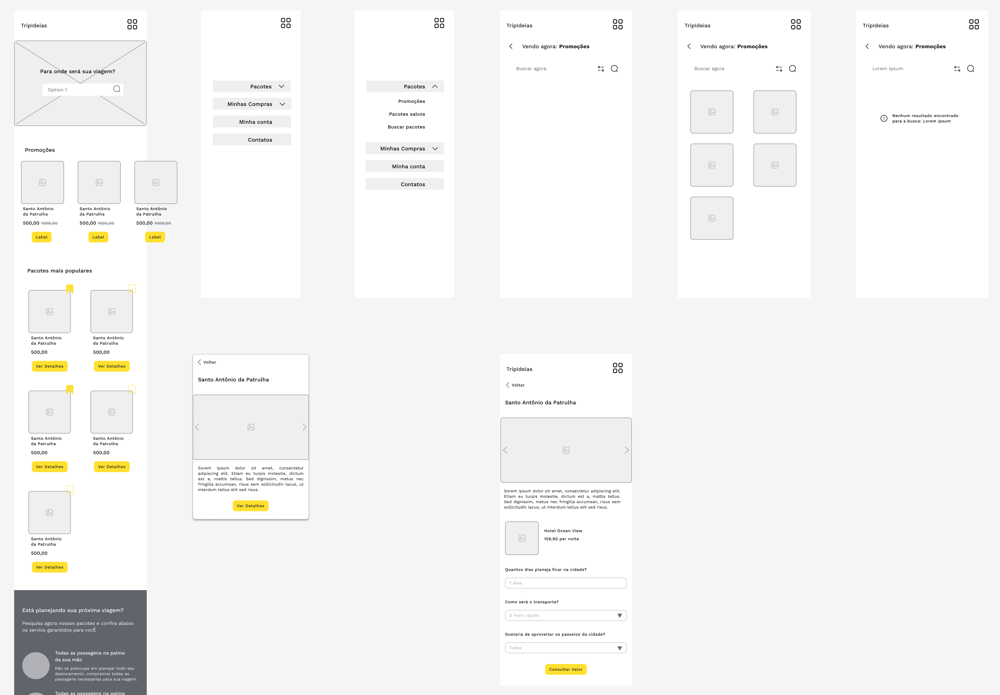

# ✈ TripIdeias
Estudo de caso criado pela alura na formação de Design UX. 
TripIdeias é uma empresa que fornece pacotes de viagem personalizados.
  
O website foi construido em CSS e JS vanilas para mover o foco para a interface em si, com implementações de pesquisa entre os pacotes, salvar os favoritos e consultar um orçamento personalizado.

### TODO
- Página inicial
    - ✅ Estrutura
    - ✅ Estilização
    - ✅ Interações
    - Links e estilo sidebar 
    - Exibir "dinâmicamente" pacotes
    - Funcionalidade salvar pacotes

- Página de pesquisa
    - Estrutura
    - Pesquisa dinâmica dos pacotes 

- Página de detalhes do pacote
    - Estrutura 