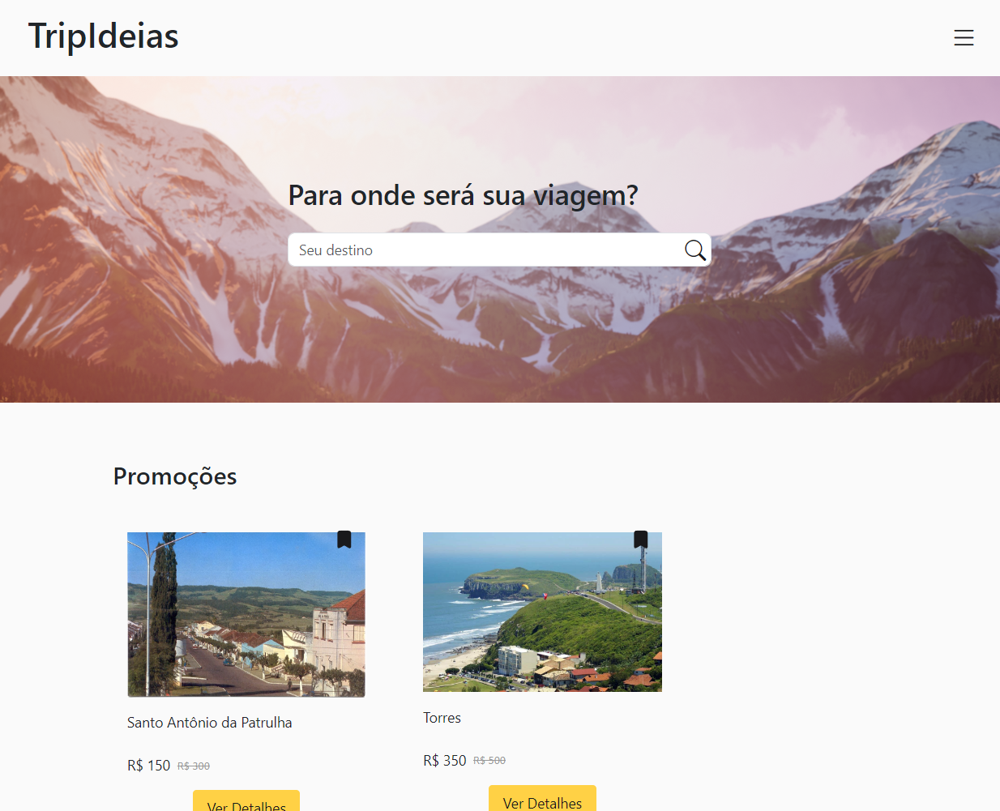
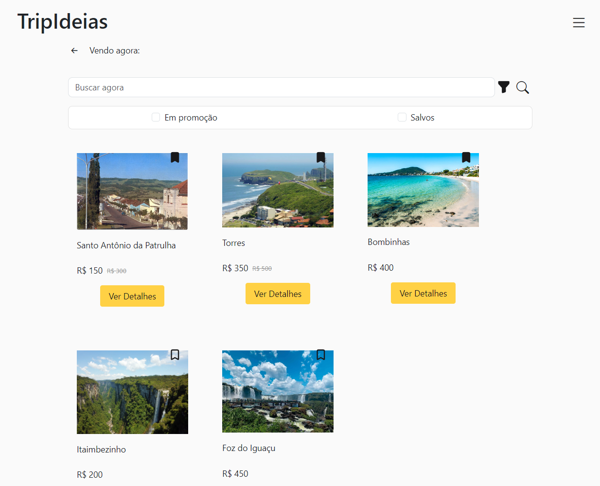

# ✈ TripIdeias
Estudo de caso criado pela alura na formação de Design UX. 
TripIdeias é uma empresa que fornece pacotes de viagem personalizados.
  
O website foi construido em CSS e JS vanilas para mover o foco para a interface em si, com implementações de pesquisa entre os pacotes, salvar os favoritos e consultar um orçamento personalizado.

## Funcionalidades

- Listagem dinâmica de todos os pacotes
- Site responsivo
- Campos de busca e filtro para pesquisa de pacotes
- Armazenamento local de informação de pacotes salvos

#### Página principal

#### Página de busca

